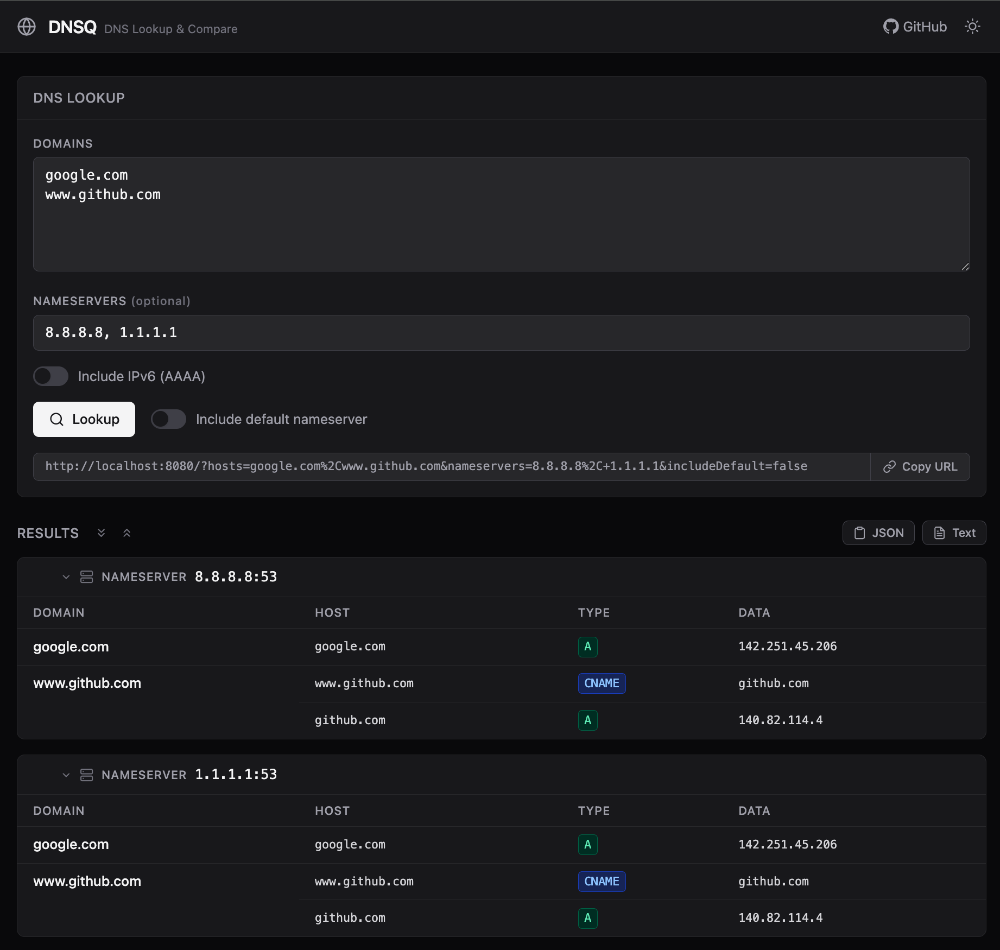

# dnsq (DNS Query)

`dnsq` is a DNS lookup tool written in Go. It provides both a command-line interface and a REST API server for performing DNS queries (CNAME, A, and optionally AAAA) across multiple domains and nameservers — making it easy to compare DNS records between different environments.

- [Motivation](#motivation)
- [Installation](#installation)
  - [HomeBrew](#homebrew)
  - [Docker](#docker)
- [Usage](#usage)
  - [CLI](#cli)
  - [Server](#server)
    - [Lookup Page](#lookup-page)
    - [API Endpoint](#api-endpoint)
  - [Kubernetes Deployment](#kubernetes-deployment)
- [Wildcard Domains](#wildcard-domains)

## Motivation

I created this DNS lookup tool for the following reasons:

1. To enable looking up multiple DNS entries simultaneously.
2. To view DNS entries in server environments like Kubernetes clusters, as my local DNS lookup results were affected by company proxy settings (e.g., Zscaler).
3. To compare DNS records across different nameservers — confirming that DNS changes have propagated correctly in the target environment.

## Installation

### HomeBrew

```bash
brew install sunggun-yu/tap/dnsq
```

### Docker

```bash
docker pull ghcr.io/sunggun-yu/dnsq
```

## Usage

### CLI

Basic usage — look up DNS records using the system default nameserver:

```bash
dnsq google.com www.github.com aws.amazon.com
```

Specify custom nameservers with `-n` / `--nameserver`:

```bash
dnsq -n 8.8.8.8 -n 1.1.1.1 google.com www.github.com
```

Include the system default nameserver alongside custom ones with `-d` / `--include-default`:

```bash
dnsq -n 8.8.8.8 -d google.com
```

Include IPv6 (AAAA) records with `--ipv6`:

```bash
dnsq --ipv6 google.com
```

Using Docker:

```bash
docker run ghcr.io/sunggun-yu/dnsq google.com aws.amazon.com
docker run ghcr.io/sunggun-yu/dnsq -n 8.8.8.8 -n 1.1.1.1 google.com
```

Example output with multiple nameservers:

```
Nameserver: 8.8.8.8:53
┌─────────────────┬─────────────────┬───────┬────────────────┐
│ Domain          │ Host            │ Type  │ Data           │
├─────────────────┼─────────────────┼───────┼────────────────┤
│ www.github.com  │ www.github.com  │ CNAME │ github.com     │
│                 │ github.com      │ A     │ 140.82.113.3   │
├─────────────────┼─────────────────┼───────┼────────────────┤
│ google.com      │ google.com      │ A     │ 142.250.80.46  │
└─────────────────┴─────────────────┴───────┴────────────────┘

Nameserver: 1.1.1.1:53
┌─────────────────┬─────────────────┬───────┬────────────────┐
│ Domain          │ Host            │ Type  │ Data           │
├─────────────────┼─────────────────┼───────┼────────────────┤
│ www.github.com  │ www.github.com  │ CNAME │ github.com     │
│                 │ github.com      │ A     │ 140.82.113.4   │
├─────────────────┼─────────────────┼───────┼────────────────┤
│ google.com      │ google.com      │ A     │ 142.250.80.78  │
└─────────────────┴─────────────────┴───────┴────────────────┘
```

### Server

```bash
dnsq server
```

By default, the server runs on port 8080. You can specify a different port using the `--port` or `-p` flag.

```bash
dnsq server -p 9090
```

You can also use the container image for a server instance:

```bash
docker run -d --name dnsq-server \
  -p 8080:8080 \
  ghcr.io/sunggun-yu/dnsq-server
```

#### Lookup Page

The lookup page provides a form for querying DNS lookups with support for:

- **Multiple domains**: Enter domain names separated by commas or one per line
- **Custom nameservers**: Optionally specify nameservers to query (comma-separated)
- **Include default nameserver**: Checkbox to include the system default nameserver alongside custom ones
- **Include IPv6 (AAAA)**: Checkbox to include AAAA records in results
- **Shareable URL**: Copy a URL that preserves your query — share it with teammates
- **Copy results**: Copy results as JSON or plain text

To access the lookup page, open your web browser and navigate to `http://localhost:8080`.

> Note: The actual URL may differ based on your deployment method or chosen port number.

<!-- TODO: update screenshot after UI changes -->


#### API Endpoint

**DNS Lookup**

- Endpoint: `/api/lookup`
- Method: `GET`
- Query Parameters:
  - `hosts` (required): comma-separated list of domain names
  - `nameservers` (optional): comma-separated list of nameservers
  - `includeDefault` (optional): `true` or `false` (default: `true`) — include default nameserver
  - `includeAAAA` (optional): `true` or `false` (default: `false`) — include AAAA records

Example request:

```bash
curl -s "http://localhost:8080/api/lookup?hosts=google.com,www.github.com&nameservers=8.8.8.8,1.1.1.1"
```

Example response:

```json
{
  "results": [
    {
      "nameserver": "8.8.8.8:53",
      "results": {
        "google.com": [
          { "host": "google.com", "type": "A", "data": "142.250.80.46" }
        ],
        "www.github.com": [
          { "host": "www.github.com", "type": "CNAME", "data": "github.com" },
          { "host": "github.com", "type": "A", "data": "140.82.113.3" }
        ]
      }
    },
    {
      "nameserver": "1.1.1.1:53",
      "results": {
        "google.com": [
          { "host": "google.com", "type": "A", "data": "142.250.80.78" }
        ],
        "www.github.com": [
          { "host": "www.github.com", "type": "CNAME", "data": "github.com" },
          { "host": "github.com", "type": "A", "data": "140.82.113.4" }
        ]
      }
    }
  ]
}
```

**App Info**

- Endpoint: `/api/info`
- Method: `GET`

Returns the application version and repository URL.

```bash
curl -s http://localhost:8080/api/info
```

```json
{
  "version": "2.0.0, commit abc123, built at 2026-04-12T00:00:00Z",
  "repo": "https://github.com/sunggun-yu/dnsq"
}
```

### Kubernetes Deployment

```bash
kubectl apply -f https://raw.githubusercontent.com/sunggun-yu/dnsq/main/manifests/install.yaml
```

## Wildcard Domains

`dnsq` supports wildcard domain lookups using the `*.` prefix:

```bash
dnsq "*.example.com"
```

Since DNS servers don't respond to literal `*` queries, `dnsq` generates a random 8-character subdomain (e.g., `ab3kf92x.example.com`) and queries that instead. If the domain has a wildcard DNS record configured, the random subdomain will resolve to the same target — effectively testing whether `*.example.com` is set up correctly.

This is particularly useful for verifying wildcard DNS entries in Kubernetes environments (e.g., wildcard ingress records).
